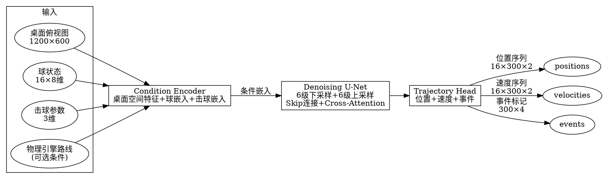

# Diffusion Trajectory Model — 设计规格说明书

> 版本: 1.0 | 日期: 2026-04-28 | 状态: 待实现

## 目录

1. [设计目标](#1-设计目标)
2. [架构总览](#2-架构总览)
3. [条件编码器](#3-条件编码器)
4. [去噪U-Net](#4-去噪u-net)
5. [轨迹输出层](#5-轨迹输出层)
6. [训练策略](#6-训练策略)
7. [推理与退化方案](#7-推理与退化方案)
8. [数据采集](#8-数据采集)
9. [摄像头规格](#9-摄像头规格)
10. [接口设计](#10-接口设计)
11. [依赖与文件规划](#11-依赖与文件规划)

---

## 1. 设计目标

用一个本地 AI 模型直接预测台球的完整轨迹，替代简化的几何物理引擎。

**核心决策：**

- 架构: Diffusion 模型（去噪概率模型）— 条件引导去噪生成轨迹
- 路线: 物理引擎 + AI 修正 → 最终过渡到纯 AI 轨迹预测
- 数据: 合成数据预训练，真实击球微调，越打越准
- 硬件: AMD 7900 XTX 24GB VRAM，推理 < 50ms

**输入输出：**

| 输入 | 说明 |
|------|------|
| 桌面俯视图 | 1200×600 透视矫正图 |
| 球状态 | 1-16 颗球 [x, y, vx, vy, 类型编码] |
| 击球参数 | [力度 0-1, 左右塞 -1~1, 高低杆 -1~1] |
| 可选: 物理引擎预测路线 | 作为条件引导去噪，无模型时可降级 |

| 输出 | 说明 |
|------|------|
| 位置序列 | 16球 × 300帧 × 2坐标 (x,y) |
| 速度序列 | 16球 × 300帧 × 2 (vx,vy) |
| 事件标记 | 每帧: [无事件, 碰撞, 进袋, 停止] |

---

## 2. 架构总览



**退化策略：**

```
模型未训练 → PhysicsEngine 直接计算 → 渲染路线
模型已训练 → PhysicsEngine 路线作为条件引导去噪 → 修正后路线
数据 > 5000杆 → 可选: 无条件去噪（纯AI路线，不依赖物理引擎）
```

---

## 3. 条件编码器

**3.1 桌面编码器 (Table Encoder)**

```
输入: 1200×600×3 俯视图 (RGB)
架构: ResNet50 (预训练权重，冻结前3个stage)
      → 8×4×512 特征图
      → 展平为 32×512
      → Linear(512→256) → 桌面嵌入
参数量: ~23M
```

直接用 ResNet50 比手工栅格更有效——学的是真实纹理、灯光、袋口外观，不是假设的几何量。

**3.2 球状态编码器 (Ball Encoder)**

```
输入: 16×8 [x, y, vx, vy, is_cue, is_black, is_solid, is_stripe]
架构: Linear(8→128) → LayerNorm → Self-Attention(4层, 8头, FFN=512)
      → 16×128 球嵌入
参数量: ~5M
```

**3.3 击球参数编码器 (Shot Encoder)**

```
输入: 3维 [力度, 左右塞, 高低杆]
架构: Linear(3→64) → SiLU → Linear(64→128) → 击球嵌入(128)
参数量: ~0.1M
```

**3.4 物理路线编码器 (Physics Path Encoder)**

```
输入: 2球(母球+目标球) × 最多8点 × 2坐标 = 32维
架构: Sinusoidal Positional Encoding → Linear(32→128)
参数量: ~0.05M
```

**3.5 条件融合**

```
桌面嵌入 (32×256) + 球嵌入 (16×128 广播至 32×128) + 击球嵌入 (广播) + 路线嵌入 (广播)
→ 全部 concat → Linear(384→512)
→ 输出: 条件嵌入 (32×512)
```

用于注入 U-Net 每一级的 Cross-Attention。

---

## 4. 去噪 U-Net

**输入:** 噪声轨迹 16×300×2 = 9600维，reshape 为 (16, 300, 2)

**输出:** 去噪轨迹 (16, 300, 2)

**时间步嵌入:** Sinusoidal 编码 t ∈ [0, 60]，注入每层 GroupNorm。

```
│ Encoder                                                        │
│ L0: Conv1d(2→64, k=3) + GroupNorm + SiLU + Self-Attn(8头)      │
│     → (16, 300, 64)                                             │
│ L1: Conv1d stride2(64→128) + Self-Attn(8头) → (16, 150, 128)   │
│ L2: Conv1d stride2(128→256) + Cross-Attn(8头) → (16, 75, 256)  │
│ L3: Conv1d stride2(256→512) + Cross-Attn(8头) → (16, 38, 512)  │
│ L4: Conv1d stride2(512→768) + Self-Attn(12头) → (16, 19, 768)  │
│ L5: Conv1d stride2(768→1024) + Cross-Attn(12头) → (16, 10, 1024)│
│                                                                 │
│ Bottleneck: Conv1d(1024→1024) + Cross-Attn(16头) + FFN(4096)   │
│                                                                 │
│ Decoder (+ Skip)                                                │
│ D5: Upsample(1024→768) + Skip-L4 → (16, 19, 768)               │
│     + Cross-Attn(8头)                                           │
│ D4: Upsample(768→512) + Skip-L3 → (16, 38, 512)                │
│     + Cross-Attn(8头)                                           │
│ D3: Upsample(512→256) + Skip-L2 → (16, 75, 256)                │
│     + Self-Attn(8头)                                            │
│ D2: Upsample(256→128) + Skip-L1 → (16, 150, 128)               │
│     + Self-Attn(8头)                                            │
│ D1: Upsample(128→64) + Skip-L0 → (16, 300, 64)                 │
│     + Self-Attn(8头)                                            │
│ D0: Conv1d(64→32, k=3) → (16, 300, 32)                         │
```

**参数量:** ~175M

**DDIM 采样:** 60步去噪，DDIM加速，sigma schedule: cosine。

---

## 5. 轨迹输出层

```
去噪后 (16, 300, 32)

├── Conv1d(32→2) + Tanh → 位置输出 (16, 300, 2)     L1 Loss
├── Conv1d(32→2)        → 速度输出 (16, 300, 2)     Huber Loss (δ=0.1)
└── Conv1d(32→4) + Softmax → 事件输出 (300, 4)      CrossEntropy
                               [无事件, 碰撞, 进袋, 停止]
```

**参数量:** ~10M

**Loss 总权重:**

```
L_total = L_pos × 1.0 + L_vel × 0.5 + L_event × 0.3 + L_smooth × 0.2

L_smooth: 相邻帧加速度 L1 约束, |a_t - a_{t-1}|
```

---

## 6. 训练策略

### 6.1 合成数据预训练（0 杆即可开始）

**数据生成:**

```
for i in range(50000):
    随机生成球分布 (母球+2~15颗目标球)
    PhysicsEngine.find_best_shot() → 基准轨迹
    随机扰动参数:
      - 力度: ±15% 乘性噪声
      - 库边弹性: ±10%
      - 袋口半径: ±8%
      - 反弹角度: ±3°
    记录: 初始状态 + 扰动后轨迹
```

**超参:**

| 参数 | 值 |
|------|-----|
| Epochs | 200 |
| Batch size | 16 |
| LR | 1e-4 (cosine decay) |
| DDIM步数 | 60 |
| 噪声调度 | Cosine |
| 训练时长 | ~4 小时 (7900 XTX) |

**输出:** `trajectory_base.pt` (~900MB FP16)

### 6.2 真实数据微调（≥500 杆触发）

```
冻结: Encoder L3-L5 + Bottleneck（底层表征收敛慢）
解冻: Decoder 全部 + Condition Encoder（适配真实桌面）
LR: 1e-5
Epochs: 50/增量
Batch: 8

每新500杆触发一次，训练 ~15 分钟
```

### 6.3 持续学习（≥5000 杆）

```
全解冻
LR: 1e-6
采样: 5000条历史 (随机) + 1000条新 → 混训
Epochs: 30/增量
触发: 每新1000杆

防灾难性遗忘 + 适应桌面磨损变化
```

### 6.4 最终收敛（≥10000杆）

- 模型基本收敛，轨迹精度 ±2mm
- 可选: 冻结模型，不再增量训练
- 可选: 完全脱离物理引擎条件引导，纯 Diffusion 推理

---

## 7. 推理与退化方案

**推理流程:**

```python
def predict_trajectory(self, table_image, balls, shot_params,
                        physics_path=None):
    # 1. 条件编码 (~8ms)
    condition = self.condition_encoder(table_image, balls,
                                       shot_params, physics_path)
    # 2. DDIM去噪 (~40ms, 60步)
    trajectory = self.ddim_sample(condition, steps=60)

    # 3. 输出解析
    return TrajectoryResult(
        positions=trajectory["positions"],
        velocities=trajectory["velocities"],
        events=trajectory["events"],
    )
```

**退化方案（级联降级）:**

```
Level 0: 模型已训练 ≥500 杆 + 物理引擎可用
  → 物理路线作为条件引导去噪 → 精度最高

Level 1: 模型已训练 ≥5000 杆
  → 可选无条件去噪 → 纯AI路线

Level 2: 模型已训练但 <500 杆
  → 仅输出物理路线（AI不干预）→ 收集数据

Level 3: 模型未加载/未训练
  → PhysicsEngine 直接计算 → 正常工作

Level 4: 模型和物理引擎都失败
  → 返回空路线，投影显示桌面轮廓（待机状态）
```

---

## 8. 数据采集

### 8.1 触发机制

```
相对变化检测:
  维护最近30帧母球位置 (0.5秒窗口)
  计算窗口内标准差 σ_window
  当前帧间位移 > 3 × σ_window → 触发击球开始
```

静默触发，不干扰正常打球。最小可检测位移 ~2-3mm。

### 8.2 录制

```
环形缓冲: 始终保留最近30帧（含击球前静止状态）
开始录制: 击球触发后，从环形缓冲前30帧开始
结束录制: 所有球连续10帧位移 < 2px
异常丢弃: 连续5帧检测不到母球 → 标记无效
```

### 8.3 数据结构

每杆保存为独立 JSON 文件（~50KB），目录: `backend/learning/collected_shots/`

```python
{
  "shot_id": 1042,
  "timestamp": 1714298400.5,
  "mode": "match",           # match / training / collect
  "initial_balls": [
    {"id": 0, "x": 0.30, "y": 0.40, "type": "cue", "vx": 0, "vy": 0},
    ...
  ],
  "trajectory": [
    {"frame": 0, "time_ms": 0,
     "balls": [{"id": 0, "x": 0.300, "y": 0.400}, ...]},
    ...
  ],
  "events": [
    {"frame": 47, "type": "collision", "ball_a": 0, "ball_b": 3},
    {"frame": 89, "type": "pocket", "ball": 3, "pocket_id": 5},
    {"frame": 180, "type": "all_stopped"},
  ],
  "outcome": {
    "ball_3": "pocketed",
    "cue_ball": {"x": 0.55, "y": 0.32}
  }
}
```

### 8.4 手机APP开关

在设置页添加:

```
┌──────────────────────────────────┐
│ 📊 轨迹数据采集         [开启 ]  │
│                                  │
│ 已采集: 342 杆                   │
│ 模型状态: 基座已就绪，等待数据    │
│                                  │
│ [一键训练]    [重新基座训练]      │
└──────────────────────────────────┘
```

---

## 9. 摄像头规格

| 指标 | 规格 | 说明 |
|------|------|------|
| 分辨率 | 1080p (1920×1080) | — |
| 帧率 | 60 FPS | 与模型 300 帧窗口对齐 |
| 焦距 | 2.8mm | 安装高度 2.1m，覆盖 2.54m 桌子 |
| 协议 | RTSP, H.264 | 5-8 Mbps，WiFi 5G 可承载 |
| 码流 | 双码流 | 主流 1080p@60 录训练数据，子码流 1080p@30 给视觉 |
| 连接 | 有线优先，WiFi 5G 备选 | — |
| 图像设置 | WDR 开启，3D降噪开启 | 台球厅灯光环境 |

**推荐型号:**
- 海康 DS-2CD1021-I (1080p@60FPS, 2.8mm, ¥200-350)
- 大华 DH-IPC-HFW1230D 同规格

**安装:**
- 吊顶俯拍，距桌面 ~2.1m
- 摄像头中心对准台球桌中心
- 尽量走网线（零丢帧，训练数据质量更高）

---

## 10. 接口设计

### 10.1 模型模块接口

```python
class DiffusionTrajectoryModel:
    """Diffusion 轨迹预测模型 — 完整生命周期"""

    # ── 模型管理 ──
    def __init__(self, model_dir: str = "")
    def load(self, path: str = "") -> bool
    def save(self, path: str = "") -> None
    def is_trained(self) -> bool  # 是否有可用的训练模型

    # ── 训练 ──
    def pretrain(self, synthetic_dataset, **hyper) -> dict  # 合成数据预训练
    def finetune(self, real_dataset, **hyper) -> dict       # 真实数据增量微调
    def train_async(self, dataset, **hyper) -> None         # 后台线程训练

    # ── 推理 ──
    def predict(self, table_image, balls: List[Ball],
                shot_params: ShotParams,
                physics_path: Optional[PhysicsPath] = None,
                condition_physics: bool = True,
                ) -> TrajectoryResult

    # ── 状态 ──
    def get_status(self) -> dict  # 训练状态、精度、参数量等
```

### 10.2 数据采集接口

```python
class TrajectoryCollector:
    """轨迹数据采集 — 后台静默运行"""

    def __init__(self, save_dir: str)
    def start(self) -> None
    def stop(self) -> None
    def is_collecting(self) -> bool
    def count(self) -> int              # 已采集杆数
    def feed_frame(self, balls: List[Ball]) -> None  # 每帧喂入
    def get_recent(self, n: int) -> List[ShotRecord]
```

### 10.3 与系统集成入口 (main.py)

```python
class PoolARSystem:
    def __init__(self):
        ...
        self.trajectory_model = DiffusionTrajectoryModel()
        self.trajectory_collector = TrajectoryCollector()

    def _compute_shot(self, ...):
        # 先尝试 Diffusion 模型
        if self.trajectory_model.is_trained():
            physics_path = self.physics.find_best_shot(cue, target)
            result = self.trajectory_model.predict(
                frame, balls, shot_params,
                physics_path, condition_physics=True
            )
            return self._trajectory_to_shot_result(result)
        # 降级: 纯物理引擎
        return self.physics.find_best_shot(cue, target)
```

### 10.4 REST API 新增

| 方法 | 路径 | 说明 |
|------|------|------|
| `GET` | `/api/model/status` | 模型状态（参数量、训练杆数、精度） |
| `POST` | `/api/model/pretrain` | 触发合成数据预训练 |
| `POST` | `/api/model/finetune` | 触发真实数据微调 |
| `GET` | `/api/model/config` | 模型配置（条件引导开关等） |
| `POST` | `/api/model/config` | 更新模型配置 |
| `GET` | `/api/collector/status` | 采集器状态 |
| `POST` | `/api/collector/start` | 开启轨迹采集 |
| `POST` | `/api/collector/stop` | 关闭轨迹采集 |

---

## 11. 依赖与文件规划

### 11.1 Python 依赖

```
torch >= 2.1          # PyTorch (需 DirectML 支持 7900 XTX)
diffusers >= 0.25     # Diffusion pipeline
torchvision >= 0.16   # ResNet50 预训练权重
opencv-python >= 4.8  # 图像预处理
numpy >= 1.26
```

### 11.2 新增文件

```
backend/learning/
├── diffusion_model.py          # DiffusionTrajectoryModel 主类
├── diffusion_unet.py           # U-Net 6级编解码器
├── diffusion_condition.py      # Condition Encoder (4路融合)
├── diffusion_trainer.py        # 训练循环 (预训练/微调)
├── trajectory_collector.py     # 轨迹数据采集 (环形缓冲+触发)
└── synthetic_data.py           # 合成数据生成器 (物理引擎扰动)

docs/superpowers/specs/
└── 2026-04-28-diffusion-trajectory-model-design.md  # 本文件
```

### 11.3 修改文件

| 文件 | 修改内容 |
|------|----------|
| `backend/learning/__init__.py` | 导出新增模块 |
| `backend/main.py` | 集成 DiffusionTrajectoryModel + TrajectoryCollector |
| `backend/api/routes.py` | 新增模型/采集器 REST 端点 |
| `backend/api/websocket.py` | 新增 `model_status` 消息类型 |
| `backend/physics/engine.py` | 新增 `generate_synthetic_trajectory()` 方法 |
| `phone-app/.../SettingsFragment.java` | 新增采集开关 + 模型状态显示 |
| `docs/DEVELOPMENT.md` | 更新模块状态 |

### 11.4 模型文件

```
backend/learning/
├── trajectory_base.pt          # 合成预训练基座模型 (~900MB)
├── trajectory_checkpoint.pt    # 最新微调 checkpoint
└── trajectory_config.json      # 模型超参 + 训练统计
```

---

## 附录 A: 参数量明细

| 模块 | 子模块 | 参数量 |
|------|--------|--------|
| Condition Encoder | ResNet50 (stage1-3冻结) | ~23M |
| Condition Encoder | Ball Self-Attn | ~5M |
| Condition Encoder | Shot MLP | ~0.1M |
| Condition Encoder | Physics Path PE | ~0.05M |
| Condition Encoder | 融合层 | ~0.2M |
| **Condition Encoder 小计** | | **~28M** |
| | | |
| U-Net | Encoder L0-L5 | ~85M |
| U-Net | Bottleneck | ~18M |
| U-Net | Decoder D0-D5 | ~70M |
| U-Net | Time Embedding | ~2M |
| **U-Net 小计** | | **~175M** |
| | | |
| Trajectory Head | 位置/速度/事件三头 | ~10M |
| | | |
| **总计** | | **~213M** |

## 附录 B: 推理性能

| 指标 | 数值 |
|------|------|
| 条件编码 | ~8ms |
| DDIM 60步去噪 | ~35ms |
| 输出解析 | ~2ms |
| **总推理** | **~45ms** |
| FP16 显存占用 | ~8GB |
| 主循环预算占比 | ~15% (45/300ms) |
